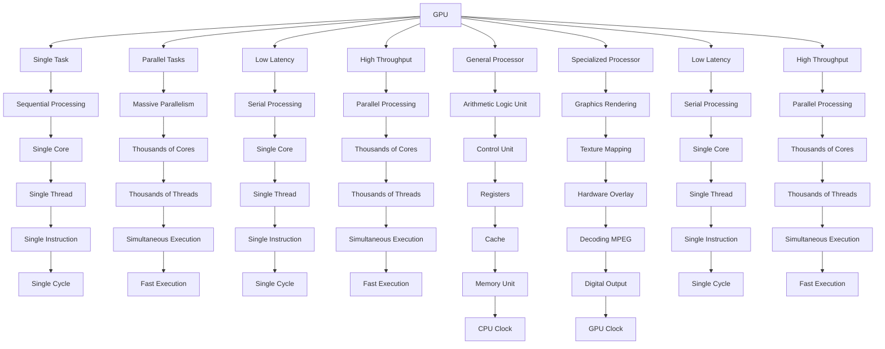

                     CUDA
                
CUDA (Compute Unified Device Architecture) is a parallel computing platform and programming model developed by NVIDIA for general computing on its own GPUs (Graphics Processing Units). It enables developers to speed up compute-intensive applications by harnessing the power of GPUs for the parallelizable part of the computation.

                             HISTORY
- **Creation of CUDA**: CUDA was developed by Nvidia in 2006 to facilitate general-purpose computing on GPUs. The primary aim was to simplify GPU programming for developers familiar with C, eliminating the need to learn a new language.

- **Evolution of GPU Computing**: Before CUDA, developers used graphics APIs like OpenGL and DirectX for general-purpose computations on GPUs. Ian Buck, a key figure in CUDA's development, pioneered GPU parallel programming at Stanford in 2000 and later joined Nvidia to lead CUDA's launch in 2006.

- **Motivation Behind CUDA**: Nvidia's CEO, Jensen Huang, envisioned GPUs as a hardware platform for scientific computing. CUDA was designed to provide direct access to GPU computational elements, compilers, and libraries, making it easier for programmers to accelerate their applications.

- **Accessibility and Language Support**: CUDA supports popular programming languages like C, C++, Fortran, and Python, making it accessible to a wide range of developers. This accessibility distinguishes CUDA from previous APIs like Direct3D and OpenGL, which required specialized graphics programming skills.

- **Applications and Domains**: CUDA has found applications in various domains, including image processing, deep learning, numerical analytics, and computational science. Its ease of use and extensive support have made it a popular choice for developers seeking to leverage GPU resources for parallel computing.

- **CUDA Cores and Parallel Programming**: CUDA cores are the heart of CUDA programming, enabling developers to harness the computational power of Nvidia GPUs for parallel tasks. Understanding CUDA cores, memory management, and thread hierarchy is crucial for optimizing performance in CUDA applications.

- **Advantages of CUDA**: CUDA offers several advantages over traditional GPU computing methods, including scattered reads, unified virtual memory, shared memory, and support for integer and bitwise operations. It provides a comprehensive ecosystem for developing high-performance GPU-accelerated applications across various domains.

- **Future of CUDA**: CUDA continues to evolve, with ongoing advancements in GPU technology and software development tools. Its versatility and efficiency in handling parallel tasks make it a valuable tool for developers looking to leverage the power of GPUs for diverse computational applications.

IN-ORDER TO LEARN GOOD COMPUTING AND THE CUDA WE NEED TO KNOW THE BASICS OF THE COMPUTER  A ND WHAT ACTUALLY ATHE COMPONTS OF THE COMPUTER THAT ACTUALLY HELP  THE CUDA TO PERFORM.

### CPU Anatomy

1. **Control Unit (CU)**: Retrieves instructions, decodes, and executes them. It also sends control signals to manage hardware and directs data around the processor system.
2. **Clock**: Helps coordinate the components of the computer by generating a timing signal.
3. **Registers**: High-speed memory used for storing operands and results of computations.
4. **Cache**: Stores frequently accessed data and instructions to reduce memory access latency.
5. **Main Memory**: System RAM used for storing data and instructions.

The CPU (Central Processing Unit) is the primary component of a computer system that carries out instructions and processes data. It is often referred to as the "brain" of the computer as it performs arithmetic, logic, control, and input/output operations. The CPU is generally made up of three main components:

#### Arithmetic and Logic Unit (ALU)

- **Function**: Performs arithmetic and logic operations such as addition, subtraction, and comparison of numbers.
- **Role**: Responsible for performing mathematical and logical functions.

#### Control Unit (CU)

- **Function**: Coordinates the activities of the computer's hardware, including sending and receiving data and managing the timing and execution of instructions.
- **Role**: Manages the various components of the computer, including the ALU, and interprets instructions from memory.

#### Registers

- **Function**: Temporary, high-speed storage locations within the CPU that hold data and instructions while they are being processed.
- **Role**: Store data and instructions temporarily for quick access.

### Key Components

- **Data Bus**: Transfers data between components.
- **Address Bus**: Transfers memory addresses between components.
- **Control Bus**: Carries control signals to coordinate operations.

### GPU Anatomy

1. **Streaming Multiprocessors (SMs)**: The main processing units within the GPU, each containing multiple CUDA Cores.
2. **CUDA Cores**: The fundamental processing units that execute instructions in parallel, grouped into Warps.
3. **Registers**: High-speed on-chip memory allocated to individual CUDA Cores, managed as “threads” in the CUDA model. Data in registers can be processed faster than in any other level of the architecture.
4. **Read-only memory**: On-chip memory available to SM.
5. **L1 Cache**: On-chip memory shared between cores, managed within CUDA as “CUDA blocks”. The L1 cache is hardware-controlled and thus enables fast data transfer.
6. **L2 Cache**: Memory shared between all CUDA blocks across multiple SMs. The cache stores both global and local memory.
7. **Global Memory**: Enables access to the device’s DRAM. This is the slowest element to access for a CUDA program.
Here is a graphical representation of the components and architecture of GPUs:


1. **CUDA Cores**: The fundamental processing units within the GPU, responsible for executing instructions in parallel.

2. **Streaming Multiprocessors (SMs)**: The main processing units within the GPU, each containing multiple CUDA Cores.

3. **Memory Hierarchy**: The GPU has a hierarchical memory structure, including registers, shared memory, and global memory.

4. **Parallel Processing**: GPUs use parallel processing to divide tasks into smaller subtasks that are distributed among a vast number of processor cores.

5. **Massive Parallelism**: GPUs have hundreds of cores, allowing them to perform massively parallel calculations.

6. **Specialized Use Cases**: GPUs are designed for specialized tasks like deep learning, big data analytics, and genomic sequencing.

7. **Advantages**: GPUs offer high data throughput, massive parallelism, and specialized acceleration for certain tasks.

8. **Limitations**: GPUs are less adept at tasks that require sequential processing or are not well structured.
   
                              MOTHERBOARD
 
A motherboard is the main circuit board of a computer that connects and supports all hardware components. It is a complex system with various components and connectors. Here is a graphical representation of a typical motherboard along with a diagram and explanations of where the CPU and GPU are located:

### Motherboard Diagram
```
  +---------------------------------------+
  |          CPU Socket (LGA 1200)        |
  +---------------------------------------+
  |          RAM Slots (4x DDR4)         |
  +---------------------------------------+
  |          Chipset (Z390)              |
  +---------------------------------------+
  |          PCIe Slots (3x x16)        |
  |          (for Graphics Cards)        |
  +---------------------------------------+
  |          SATA Ports (6x)            |
  |          (for Storage Devices)      |
  +---------------------------------------+
  |          USB Ports (4x)             |
  |          (for Peripherals)          |
  +---------------------------------------+
  |          Audio Jacks (3.5mm)        |
  |          (for Headphones and Speakers) |
  +---------------------------------------+
  |          Ethernet Port (RJ-45)      |
  |          (for Network Connection)    |
  +---------------------------------------+
  |          Power Connectors (8-pin, 4-pin) |
  |          (for Power Supply)          |
  +---------------------------------------+
  |          Fan Connectors (4x)        |
  |          (for Cooling Fans)         |
  +---------------------------------------+
```

### Explanation of Components
- **CPU Socket (LGA 1200)**: This is where the CPU (Central Processing Unit) is installed. It is a socket that connects the CPU to the motherboard.
- **RAM Slots (4x DDR4)**: These are where the RAM (Random Access Memory) modules are installed. The motherboard supports DDR4 RAM.
- **Chipset (Z390)**: This is the main logic chip that manages data transfer between the CPU, memory, and peripherals.
- **PCIe Slots (3x x16)**: These are where graphics cards (GPUs) are installed. The x16 slots are designed for high-bandwidth devices like graphics cards.
- **SATA Ports (6x)**: These are where storage devices like hard drives and solid-state drives are connected.
- **USB Ports (4x)**: These are where peripherals like keyboards, mice, and flash drives are connected.
- **Audio Jacks (3.5mm)**: These are where headphones and speakers are connected.
- **Ethernet Port (RJ-45)**: This is where a network cable is connected for internet access.
- **Power Connectors (8-pin, 4-pin)**: These are where the power supply connects to the motherboard.
- **Fan Connectors (4x)**: These are where cooling fans are connected to the motherboard.

### CPU and GPU Locations
- **CPU (Central Processing Unit)**: The CPU is installed in the CPU socket (LGA 1200).
- **GPU (Graphics Processing Unit)**: The GPU is installed in one of the PCIe slots (x16).


### CUDA Execution Process

1. **CPU Execution**: The CPU executes the main program and identifies the parts that can be parallelized using CUDA.
2. **Memory Allocation**: The CPU allocates memory on the GPU’s global memory and copies the necessary data from the CPU’s main memory.
3. **CUDA Kernel Launch**: The CPU launches a CUDA kernel, which is a function that runs in parallel on the GPU’s CUDA Cores.
4. **CUDA Core Execution**: Each CUDA Core executes the same kernel function on different parts of the data, taking advantage of the GPU’s massive parallelism.
5. **Memory Access**: CUDA Cores access data from global memory, shared memory, and registers to perform computations.
6. **Result Storage**: The results are stored back in global memory, and the CPU copies the output data from the GPU’s memory to the CPU’s main memory.
7. **Synchronization**: The CPU and GPU synchronize their execution to ensure that the CPU waits for the GPU to finish processing before proceeding.

### CUDA Architecture

CUDA is designed to work with programming languages such as C, C++, Fortran, and Python, making it accessible to developers familiar with these languages. CUDA provides a set of APIs and libraries to manage memory, launch kernels, and synchronize execution.

### CUDA Memory Hierarchy

CUDA uses a hierarchical memory structure to manage data access, including registers, read-only memory, L1 cache, L2 cache, and global memory.

### CUDA Programming Model

CUDA is a parallel programming paradigm that allows developers to define threads and blocks, which are executed in parallel on the GPU. CUDA kernels are functions that run on the GPU and are launched by the CPU.

### CUDA Performance Boost

CUDA has improved significantly over the years, with advancements in GPU architecture and software tools. The performance boost comes from:

1. **Parallel Processing**: Thousands of GPU cores executing in parallel, making it much faster than CPUs for certain tasks.
2. **Memory Hierarchy**: Efficient memory management and access, allowing for faster data transfer and processing.
3. **Optimized Kernels**: CUDA kernels are optimized for GPU architecture, resulting in significant performance improvements.

IN CASE YOU WERE NOT ABLE TO GET THE ABOVE HERE IS THE STEP BY STEP PROCESS:


1. **CPU Execution**: The CPU executes the main program and identifies the parts that can be parallelized using CUDA.

2. **Identify Parallelizable Parts**: The CPU analyzes the program and determines which parts can be accelerated using the GPU's parallel processing capabilities.

3. **Memory Allocation**: The CPU allocates memory on the GPU's global memory and copies the necessary data from the CPU's main memory.

4. **Copy Data to GPU Memory**: The CPU transfers the required data from the CPU's main memory to the GPU's global memory.

5. **CUDA Kernel Launch**: The CPU launches a CUDA kernel, which is a function that runs in parallel on the GPU's CUDA Cores.

6. **CUDA Core Execution**: Each CUDA Core executes the same kernel function on different parts of the data, taking advantage of the GPU's massive parallelism.

7. **Memory Access**: CUDA Cores access data from global memory, shared memory, and registers to perform computations.

8. **Result Storage**: The results are stored back in global memory.

9. **Copy Results to CPU Memory**: The CPU copies the output data from the GPU's global memory to the CPU's main memory.

10. **CPU Synchronization**: The CPU waits for the GPU to finish processing before proceeding.

Here's a step-by-step explanation of the CUDA execution process:

1. The CPU executes the main program and identifies the parts that can be parallelized using CUDA.

2. The CPU analyzes the program and determines which parts can be accelerated using the GPU's parallel processing capabilities.

3. The CPU allocates memory on the GPU's global memory and copies the necessary data from the CPU's main memory.

4. The CPU transfers the required data from the CPU's main memory to the GPU's global memory.

5. The CPU launches a CUDA kernel, which is a function that runs in parallel on the GPU's CUDA Cores.

6. Each CUDA Core executes the same kernel function on different parts of the data, taking advantage of the GPU's massive parallelism.

7. CUDA Cores access data from global memory, shared memory, and registers to perform computations.

8. The results are stored back in global memory.

9. The CPU copies the output data from the GPU's global memory to the CPU's main memory.

10. The CPU waits for the GPU to finish processing before proceeding.

NOW THAT YOU UNDERSTAND WHAT A CPU AND GPU ARE, HERE IS A DETAILED COMPARISON BETWEEN THE TWO TO ENHANCE YOUR FAMILIARITY WITH THEIR DIFFERENCES:



This diagram highlights the key differences between the CPU and GPU, including:

- **CPU vs. GPU Architecture**: The CPU has a single core and is designed for sequential processing, while the GPU has thousands of cores and is designed for parallel processing.
- **CPU vs. GPU Performance**: The CPU is optimized for low latency and serial processing, while the GPU is optimized for high throughput and parallel processing.
- **CPU vs. GPU Functions**: The CPU is a general processor that performs arithmetic and logic operations, while the GPU is a specialized processor that focuses on graphics rendering and parallel processing.
- **CPU vs. GPU Memory**: The CPU has a smaller cache and memory, while the GPU has a larger memory and cache to handle parallel processing.
- **CPU vs. GPU Clock Speed**: The CPU has a lower clock speed, while the GPU has a higher clock speed to handle parallel processing.


### CPU vs. GPU Explanation

1. **CPU**: Designed for single-task processing, sequential processing, and single-core processing. It is optimized for single-threaded performance.

2. **GPU**: Designed for parallel processing, massive parallelism, and thousands of cores. It is optimized for parallel processing and thousands of threads.

### CUDA Performance

CUDA is a software layer that gives direct access to the GPU's virtual instruction set and parallel computational elements for the execution of compute kernels. CUDA's performance is based on the following key features:

1. **Parallel Processing**: CUDA enables massive parallelism by executing thousands of threads simultaneously.

2. **GPU Architecture**: CUDA takes advantage of the GPU's architecture, which includes thousands of cores and a hierarchical memory structure.

3. **Memory Hierarchy**: CUDA uses a hierarchical memory structure, including registers, shared memory, and global memory, to manage data access efficiently.

4. **Optimized Kernels**: CUDA kernels are optimized for GPU architecture, resulting in significant performance improvements.

5. **Memory Access**: CUDA Cores access data from global memory, shared memory, and registers to perform computations.

6. **Result Storage**: The results are stored back in global memory.

7. **Copy Results to CPU Memory**: The CPU copies the output data from the GPU's global memory to the CPU's main memory.

8. **CPU Synchronization**: The CPU waits for the GPU to finish processing before proceeding.

CUDA is a powerful tool that allows developers to harness the immense parallel processing capabilities of Nvidia GPUs. It works by breaking down computationally intensive tasks into smaller, independent parts that can be executed simultaneously by thousands of CUDA cores.

Imagine you have a huge pile of work that needs to be done, like calculating the color of every pixel on a screen for a video game. With a regular CPU, you'd have to do each task one by one, which would take forever. But with CUDA, you can divide that pile of work into smaller piles and have a bunch of people (CUDA cores) work on them at the same time.

Each CUDA core is like a little worker bee, capable of performing arithmetic and logical operations. They're grouped together into larger units called streaming multiprocessors (SMs), which can execute hundreds of threads concurrently[4]. This is what gives CUDA its incredible speed and efficiency.

Imagine a beehive, where each bee (CUDA core) has a specific job to do, like collecting nectar or building honeycomb. The bees work together in their hive (SM), and the hives work together to create the entire beehive (GPU). This is how CUDA can process so much information so quickly.

But CUDA is more than just a bunch of worker bees. It's a whole ecosystem designed to make GPU programming as easy and accessible as possible. CUDA provides a set of tools, libraries, and APIs that allow developers to write code in familiar languages like C++ and have it run on Nvidia GPUs.

Imagine you're a chef who loves to cook, but you only have a small kitchen with a tiny stove. CUDA is like a magical extension that turns your small kitchen into a huge commercial kitchen, with multiple ovens and stovetops. Now you can cook way more food (process way more data) in the same amount of time.

CUDA has been a game-changer for many industries, from gaming and animation to scientific research and artificial intelligence. By making GPU programming more accessible, CUDA has enabled developers to create amazing things that were once thought impossible.

"CUDA UNLEASHES THE POWER OF PARALLEL PROCESSING. WITH PASSION AND EXCELLENCE, WE CAN ACHIEVE THE EXTRAORDINARY."

HERE IS A MOTIVATIONAL QUOTE FOR YOU WHO'VE COME THIS FAR:

"EVEN IN THE DARKEST MOMENTS, HOPE IS THE LIGHT THAT GUIDES US FORWARD. BELIEVE IN YOUR STRENGTH, FOR WITH EACH STEP, YOU MOVE CLOSER TO A BRIGHTER FUTURE."

### BRAVO  👏👏👏👏👏👏👏👏👏👏👏👏👏👏👏👏

                    ADVANCEMENTS IN THE INDUSTRY OF HEALTHCARE

In healthcare, CUDA finds applications in various critical areas, leveraging its parallel computing power to accelerate computations and improve patient care. Some industrial applications of CUDA in healthcare include:

1. **Medical Imaging**: CUDA is used for accelerating image reconstruction, processing, and analysis in modalities like MRI, CT scans, PET scans, and ultrasound. It enables real-time visualization, 3D rendering, and feature extraction, aiding in diagnosis, treatment planning, and surgical guidance.

2. **Radiation Therapy**: CUDA is employed for Monte Carlo simulations and dose calculations in radiation therapy treatment planning. It helps optimize treatment parameters, simulate radiation interactions with tissues, and ensure accurate dose delivery while minimizing side effects to surrounding healthy tissues.

3. **Genomic Analysis**: CUDA accelerates genomic sequencing, alignment, and variant calling processes in bioinformatics applications. It enables rapid analysis of large-scale genomic datasets, identification of genetic mutations, and personalized medicine approaches for cancer treatment and rare diseases.

4. **Drug Discovery**: CUDA is utilized for molecular dynamics simulations, ligand-protein docking, and virtual screening in pharmaceutical research. It speeds up the identification of potential drug candidates, prediction of drug-target interactions, and optimization of drug molecules, facilitating the development of new therapies and treatments.

5. **Electroencephalography (EEG) and Electromyography (EMG)**: CUDA accelerates signal processing and analysis in EEG and EMG recordings for diagnosing neurological disorders, monitoring brain activity, and assessing muscle function. It enables real-time data processing, artifact removal, and feature extraction to aid in clinical decision-making.

6. **Medical Robotics**: CUDA powers image-guided surgical systems, robotic-assisted surgeries, and medical robots for minimally invasive procedures. It enhances real-time image registration, surgical navigation, and tissue segmentation, improving surgical accuracy, precision, and patient outcomes.

7. **Healthcare Analytics**: CUDA accelerates data analytics tasks in healthcare systems, including predictive modeling, anomaly detection, and population health management. It enables efficient processing of electronic health records (EHRs), medical images, and sensor data for clinical decision support, disease surveillance, and healthcare resource optimization.

8. **Biomedical Signal Processing**: CUDA speeds up processing of physiological signals such as electrocardiograms (ECG), electroencephalograms (EEG), and blood pressure waveforms. It enables real-time analysis of vital signs, detection of abnormalities, and patient monitoring in intensive care units (ICUs) and emergency departments.

Overall, CUDA plays a vital role in advancing medical research, improving diagnostic capabilities, optimizing treatment strategies, and enhancing patient care in healthcare settings.

**Technical Aspects**:

1. **Parallel Processing**: CUDA allows developers to write programs that can execute thousands of small tasks simultaneously on the GPU, leveraging its parallel processing capabilities.

2. **CUDA Cores**: GPUs consist of many smaller processing units called CUDA cores. These cores can execute instructions independently, enabling massive parallelism.

3. **Memory Hierarchy**: CUDA provides access to various memory types on the GPU, such as global memory, shared memory, and constant memory, allowing developers to optimize data access patterns for better performance.

4. **Programming Model**: CUDA uses a C-like programming language with extensions for parallelism, allowing developers to write code that can be executed on both the CPU and GPU.


**Non-Technical Aspects**:

1. **Performance**: CUDA can significantly accelerate computations compared to traditional CPU-based approaches, making it valuable for various industries and applications.

2. **Accessibility**: NVIDIA provides comprehensive documentation, tutorials, and tools for developers to learn and use CUDA effectively, making it accessible to both beginners and experienced programmers.

3. **Community**: There is a large community of developers and researchers working with CUDA, providing support, sharing resources, and collaborating on projects.

**Impact on Beginners and Professionals**:

For beginners, learning CUDA opens up opportunities to work on cutting-edge technologies in fields like machine learning, scientific computing, and computer graphics. It equips them with valuable skills in parallel programming and GPU computing, which are in high demand in industries such as finance, healthcare, and entertainment.

For professionals, CUDA offers the ability to accelerate complex computations and develop high-performance applications. It enables them to tackle larger datasets, run simulations faster, and build more efficient algorithms, ultimately leading to innovations and advancements in their respective fields.

**Skills Developed by Working with CUDA**:

1. **Parallel Programming**: Understanding how to design and optimize algorithms for parallel execution on the GPU.
2. **GPU Architecture**: Knowledge of GPU architecture and memory hierarchy to effectively utilize GPU resources.
3. **Performance Optimization**: Skills in optimizing code for performance, including memory management, data parallelism, and kernel optimization.
4. **Domain-specific Knowledge**: Depending on the application area, expertise in fields like machine learning, physics simulations, or computer graphics.

**Importance of CUDA**:

1. **Performance**: CUDA enables developers to achieve significant performance improvements by leveraging the parallel processing power of GPUs.
2. **Scalability**: With CUDA, applications can scale efficiently to handle larger datasets and more complex computations.
3. **Innovation**: CUDA has enabled breakthroughs in various fields by accelerating computations and enabling new approaches to problem-solving.

Overall, CUDA has become an essential tool for developers and researchers working on computationally intensive tasks, driving advancements across industries and opening up new possibilities for innovation and discovery.

## Q1. What was the need to do this? Give 4 examples.

1. **Accelerate scientific computing**: CUDA allows scientists and researchers to harness the massive parallel processing power of GPUs to speed up computationally intensive tasks like molecular dynamics simulations, weather forecasting, and medical imaging[1][3].

2. **Improve machine learning and AI**: CUDA is widely used in deep learning frameworks like TensorFlow and PyTorch to train and deploy neural networks on GPUs, leading to significant performance improvements[2].

3. **Enhance video processing and encoding**: CUDA is used in video editing software and media servers to accelerate video encoding, transcoding, and real-time processing[1].

4. **Boost financial modeling and risk analysis**: Financial institutions use CUDA to speed up complex financial modeling, risk analysis, and portfolio optimization calculations[1].

## Q2. What is the history of this? Understand with examples. Give 4 examples.

1. **CUDA was first introduced by NVIDIA in 2006** as a way to enable general-purpose computing on their GPUs[3].

2. **The CUDA programming model** is based on C/C++ language extensions and APIs, making it accessible to developers familiar with these languages[1][4].

3. **Over the years, NVIDIA has continuously improved CUDA** by introducing new features, such as Unified Memory, Cooperative Groups, and CUDA Graphs, to simplify programming and improve performance[1].

4. **CUDA has become the de facto standard for GPU computing**, with widespread adoption in various industries and the availability of numerous libraries and tools to support development[2][3].

## Q3. If we do NOT use it, what will happen? Give 4 examples.

1. **Scientific computing will be slower**: Without CUDA, computationally intensive scientific applications will run slower on CPUs, limiting the ability to tackle complex problems and slowing down research progress[1][3].

2. **Machine learning and AI will be less efficient**: Training and deploying neural networks on CPUs alone will be much slower, making it harder to develop and deploy advanced AI systems[2].

3. **Video processing will be more resource-intensive**: Video editing and encoding tasks will consume more CPU resources, leading to slower performance and reduced efficiency[1].

4. **Financial modeling will be less accurate and timely**: Complex financial calculations will take longer to complete, making it harder to make informed decisions and manage risk effectively[1].

## Q4. What are the other options for doing this? Give 4 examples.

1. **OpenCL (Open Computing Language)**: An open standard for parallel programming of heterogeneous systems, including GPUs from different vendors[2].

2. **DirectCompute**: A part of Microsoft's DirectX API, which provides a GPU-accelerated computing framework for Windows[3].

3. **Intel oneAPI**: A cross-architecture programming model that supports CPUs, GPUs, and FPGAs from Intel and other vendors[2].

4. **Vulkan**: A low-overhead, cross-platform 3D graphics and computing API that can be used for GPU computing tasks[3].

## Q5. Why to use it? Give 4 examples.

1. **Significant performance gains**: CUDA can provide orders of magnitude faster performance compared to CPU-only implementations for certain types of parallel workloads[1][3].

2. **Ease of use**: CUDA provides a familiar programming model based on C/C++ and integrates well with existing software stacks[4].

3. **Extensive ecosystem**: CUDA has a large and active ecosystem with numerous libraries, tools, and frameworks available to support development[2][3].

4. **Vendor support**: CUDA is developed and maintained by NVIDIA, ensuring ongoing support and compatibility with their GPU hardware[1].

## Q6. When to use it? Give 4 examples.

1. **When you have a problem that can be parallelized**: CUDA is most effective for problems that can be broken down into many smaller, independent tasks that can be executed concurrently on a GPU[1][3].

2. **When you have access to NVIDIA GPUs**: CUDA is specific to NVIDIA GPUs and requires compatible hardware to run[1][3].

3. **When you need to accelerate computationally intensive tasks**: CUDA is particularly useful for applications that involve a lot of floating-point calculations, such as scientific computing, machine learning, and image processing[1][2].

4. **When you have the resources and expertise to invest in CUDA development**: Developing CUDA applications requires specialized knowledge and resources, such as access to NVIDIA GPUs and the CUDA Toolkit[4].

## Q7. When to NOT use it? Give 4 examples.

1. **When you don't have access to NVIDIA GPUs**: CUDA is specific to NVIDIA hardware and won't work on other GPU architectures or CPUs[1][3].

2. **When your problem doesn't parallelize well**: Some problems are inherently sequential or have complex dependencies that make them difficult to parallelize effectively on a GPU[1].

3. **When you have limited resources or expertise**: Developing CUDA applications requires specialized knowledge and resources, which may not be available in all organizations or projects[4].

4. **When you need cross-platform compatibility**: CUDA is specific to NVIDIA GPUs and may not be the best choice if you need to support a wide range of hardware platforms or operating systems[2][3].

## Q8. How to use it? Give 4 examples.

1. **Install the CUDA Toolkit**: Download and install the CUDA Toolkit from the NVIDIA Developer website, which includes the CUDA compiler (nvcc), libraries, and tools[1][4].

2. **Write CUDA code**: Use CUDA extensions to C/C++ to define kernels (functions that run on the GPU) and launch them from the host (CPU) code[4].

3. **Compile CUDA code**: Use the nvcc compiler to compile CUDA code into executable binaries that can run on NVIDIA GPUs[4].

4. **Integrate CUDA into your application**: Use CUDA APIs to manage memory, launch kernels, and synchronize execution between the host and device (GPU)[1][3].

## Q9. How to understand the principle of a tech working in a real-world non-tech scenario? Give 4 examples.

1. **Parallelism in manufacturing**: Just as CUDA leverages the parallel processing power of GPUs, assembly lines in manufacturing can be seen as a form of parallelism, where multiple workers or machines work concurrently to produce goods more efficiently[1].

2. **Divide and conquer in problem-solving**: The CUDA programming model of breaking down problems into smaller, independent tasks that can be executed concurrently is similar to the divide and conquer strategy used in problem-solving, where a complex problem is divided into smaller, more manageable sub-problems[1][3].

3. **Specialization in the workforce**: In the same way that CUDA leverages the specialized capabilities of GPUs for certain types of computations, many industries rely on specialized workers or teams to perform specific tasks more efficiently[1].

4. **Just-in-time delivery in logistics**: The concept of launching kernels on demand in CUDA is analogous to just-in-time delivery in logistics, where goods are produced or delivered only when needed, reducing waste and improving efficiency[1].

## Q10. How to understand the principle of a tech working in a real-world tech scenario? Give 4 examples.

1. **Distributed computing in cloud platforms**: Similar to how CUDA leverages multiple GPUs to accelerate computations, cloud platforms use distributed computing to harness the power of multiple servers or virtual machines to process large amounts of data or handle high-traffic workloads[2].

2. **Parallel processing in big data frameworks**: Frameworks like Apache Spark and Hadoop use parallel processing techniques to distribute data processing tasks across multiple nodes in a cluster, similar to how CUDA distributes computations across GPU threads[2].

3. **Heterogeneous computing in mobile devices**: Modern mobile devices often use a combination of CPUs and GPUs to handle different types of workloads, similar to how CUDA leverages both the host (CPU) and device (GPU) to execute applications[3].

4. **Asynchronous programming in web development**: The concept of launching kernels asynchronously in CUDA is analogous to asynchronous programming techniques used in web development, where tasks are executed concurrently to improve responsiveness and performance[4].

## Q11. What does each word in the line mean? Give 4 examples.

1. **Compute**: The act of performing calculations or processing data[1][3].

2. **Unified**: Integrated or combined into a single system or entity[1].

3. **Device**: A piece of equipment or a mechanism designed to serve a special purpose or perform a special function[1][3].

4. **Architecture**: The fundamental organization of a system, embodied in its components, their relationships to each other and to the environment, and the principles governing its design and evolution[1][3].

## Q12. What are other available ways to do the same thing? Give 4 examples.

1. **OpenCL**: An open standard for parallel programming of heterogeneous systems, including GPUs from different vendors[2].

2. **DirectCompute**: A part of Microsoft's DirectX API, which provides a GPU-accelerated computing framework for Windows[3].

3. **Intel oneAPI**: A cross-architecture programming model that supports CPUs, GPUs, and FPGAs from Intel and other vendors[2].

4. **Vulkan**: A low-overhead, cross-platform 3D graphics and computing API that can be used for GPU computing tasks[3].

## Q14. What are the best industry standards practices, and what is the need to do so? Give 4 examples. What are the harms of not following best practices? Give examples.

1. **Best practices for CUDA development**: NVIDIA provides guidelines and best practices for CUDA development, such as using coalesced memory access, minimizing branch divergence, and optimizing memory usage[1][4].

2. **Adherence to coding standards**: Following coding standards and best practices helps maintain code quality, readability, and maintainability, which is crucial for large-scale CUDA projects[4].

3. **Proper error handling**: Implementing robust error handling and checking for CUDA API errors is essential to ensure the reliability and stability of CUDA applications[1][4].

4. **Profiling and optimization**: Using NVIDIA profiling tools and following best practices for performance optimization helps ensure that CUDA applications are running efficiently and taking full advantage of the GPU hardware[1][3].

Harms of not following best practices:

1. **Suboptimal performance**: Not following CUDA best practices can lead to inefficient use of GPU resources, resulting in slower performance and longer execution times[1][3].

2. **Increased development and maintenance costs**: Poorly written CUDA code that doesn't adhere to best practices can be harder to debug, maintain, and extend over time, leading to higher development and maintenance costs[4].

3. **Reduced code quality and readability**: Ignoring coding standards and best practices can result in code that is harder to understand, modify, and collaborate on, especially in large-scale projects with multiple developers[4].

4. **Potential for bugs and crashes**: Failing to implement proper error handling and checking for CUDA API errors can lead to bugs, crashes, and undefined behavior in CUDA applications[1][4].

Citations:
[1] https://github.com/NVIDIA/cuda-samples

NOW WE DISCOVER THE TERM HIGH PERFORMANCE COMPUTING?

WHAT IS HIGH PERFORMANCE COMPUTING?

High-performance computing (HPC) is the art and science of using groups of cutting edge computer systems to perform complex simulations, computations, and data analysis out of reach for standard commercial compute systems available.


What is HPC?
HPC computer systems are characterized by their high-speed processing power, high-performance networks, and large-memory capacity, generating the capability to perform massive amounts of parallel processing. A supercomputer is a type of HPC computer that is highly advanced and provides immense computational power and speed, making it a key component of high-performance computing systems.
Sure, here's a simple diagram and explanation that illustrates the key differences between high-performance computing (HPC) and traditional computing:

### High-Performance Computing (HPC) Diagram

```
               +---------------------+
               |    High-Performance |
               |      Computing      |
               +---------------------+
                      /     \
                     /       \
         +-----------+         +-----------+
         |  Parallel |         |   Massive |
         | Processing|         | Data Sets |
         +-----------+         +-----------+
              |                       |
   +------------------+     +------------------+
   | Multiple CPUs/GPUs|   | Distributed Systems|
   +------------------+     +------------------+
              |                       |
    +------------------------+ +------------------------+
    | Specialized Software & | | High-Speed Networking |
    | Algorithms             | | Infrastructure         |
    +------------------------+ +------------------------+
                      |               |
             +---------------------------+
             | Optimized for Speed &     |
             | Computationally Intensive |
             | Tasks                     |
             +---------------------------+
```

### Explanation

**High-Performance Computing (HPC):**
- **Parallel Processing:** Uses multiple CPUs/GPUs to perform computations simultaneously, significantly speeding up processing times for large and complex tasks.
- **Massive Data Sets:** Capable of handling and processing vast amounts of data, making it suitable for tasks such as simulations, large-scale computations, and data analysis.
- **Multiple CPUs/GPUs:** Utilizes the power of multiple processors to achieve high computation speed.
- **Distributed Systems:** Often involves a network of computers working together to solve complex problems.
- **Specialized Software & Algorithms:** Requires software designed to optimize performance across multiple processors and handle large data sets efficiently.
- **High-Speed Networking Infrastructure:** Ensures fast data transfer and communication between distributed systems.
- **Optimized for Speed & Computationally Intensive Tasks:** Designed to perform complex calculations quickly and efficiently, often used in scientific research, financial modeling, and engineering simulations.

**Traditional Computing:**
- **Single CPU:** Typically relies on a single processor to handle tasks, leading to slower processing times for complex computations.
- **Limited Data Handling:** Not optimized for processing large data sets, making it less suitable for data-intensive tasks.
- **General-Purpose Software:** Uses standard software applications not specifically designed for high-speed or parallel processing.
- **Standard Networking:** Utilizes regular networking infrastructure, which may not support the high-speed data transfer required for HPC tasks.
- **Designed for General Tasks:** Ideal for everyday computing tasks such as word processing, web browsing, and basic data analysis.

In recent years, HPC has evolved from a tool focused on simulation-based scientific investigation to a dual role running simulation and machine learning (ML). This increase in scope for HPC systems has gained momentum because the combination of physics-based simulation and ML has compressed the time to scientific insight for fields such as climate modeling, drug discovery, protein folding, and computational fluid dynamics (CFD).
